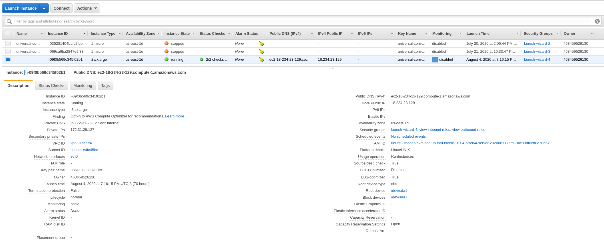

# Terraform

O terraform foi criado com o esquema de módulos, então eu consigo adicionar mais módulos conforme a necessidade do projeto, este eu criei apenas o airflow_terraform, e chamo o modulo no arquivo `main.tf` na raiz do projeto.

