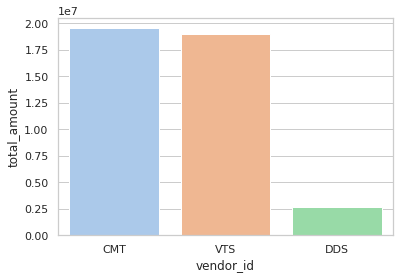
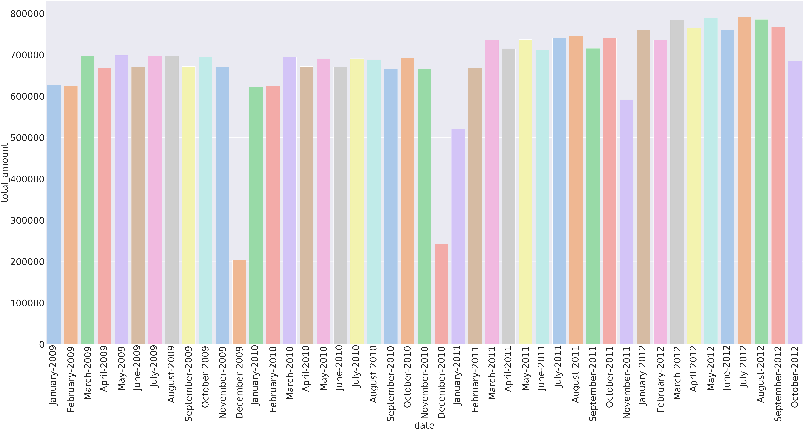
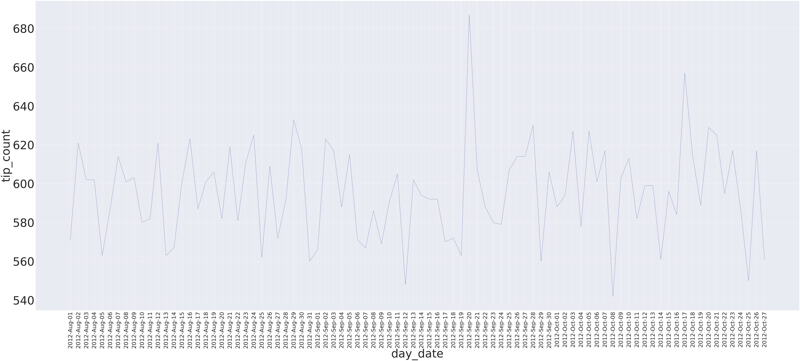
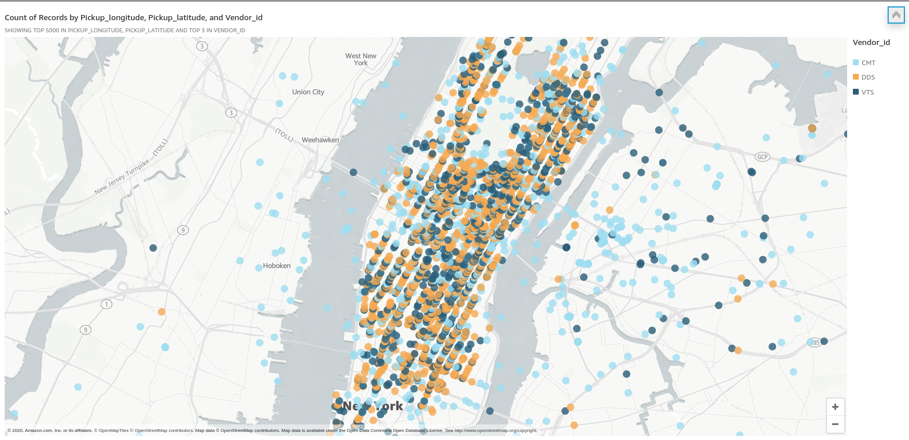

# DataSprints Case


```python
# Import libs
%matplotlib inline
import pandas as pd
import seaborn as sns
import utils
import calendar
import matplotlib.pyplot as plt
from IPython.display import Image
from matplotlib import dates
pd.options.display.max_colwidth = 1000
pd.set_option('display.max_rows', 18000)
```


```python
# Connect to database
database_access = utils.get_database_access()
airflow_handler = utils.DatabaseHandler(database_access["airflow"])
```

## Quesitos Minimos

### Qual a distância média percorrida por viagens com no máximo 2 passageiros


```python
# Fetch Query Airflow
query_2_passengers = f"""
    select trip_distance
    from nyc_taxi.nyctaxi_trips
    where passenger_count <= 2
    and trip_distance > 0
"""
# Run Query
two_passenger = pd.DataFrame(airflow_handler.fetch(query_2_passengers))
```


```python
trip_distance_describe = two_passenger['trip_distance'].describe()
print(f'Total de viagens feitas com ate 2 passageiros: {int(trip_distance_describe[0])}')
print(f'Kilometragem media de viagens feitas com ate 2 passageiros: {round(trip_distance_describe[1], 2)}')
print(f'Kilometragem minima de viagens feitas com ate 2 passageiros: {trip_distance_describe[3]}')
print(f'Kilometragem maxima de viagens feitas com ate 2 passageiros: {trip_distance_describe[7]}')
```

    Total de viagens feitas com ate 2 passageiros: 3288172
    Kilometragem media de viagens feitas com ate 2 passageiros: 2.69
    Kilometragem minima de viagens feitas com ate 2 passageiros: 0.002
    Kilometragem maxima de viagens feitas com ate 2 passageiros: 49.7


### Quais os 3 maiores ​ vendors ​ em quantidade total de dinheiro arrecadado


```python
# Fetch Query Airflow
query_3_big_vendors = f"""
    select vendor_id
        ,sum(trip_distance) as trip_distance
        ,sum(total_amount) as total_amount
        ,sum(tip_amount) as tip_amount
    from nyc_taxi.nyctaxi_trips
    group by vendor_id
    order by total_amount desc
    limit 3;
"""
# Run Query
big_vendors = pd.DataFrame(airflow_handler.fetch(query_3_big_vendors))
```


```python
big_vendors['total_amount'] = big_vendors['total_amount'].apply(lambda data: float('%.5f' % data))
```


```python
big_vendors
```


<div>
<style scoped>
    .dataframe tbody tr th:only-of-type {
        vertical-align: middle;
    }

    .dataframe tbody tr th {
        vertical-align: top;
    }

    .dataframe thead th {
        text-align: right;
    }
</style>
<table border="1" class="dataframe">
  <thead>
    <tr style="text-align: right;">
      <th></th>
      <th>vendor_id</th>
      <th>trip_distance</th>
      <th>total_amount</th>
      <th>tip_amount</th>
    </tr>
  </thead>
  <tbody>
    <tr>
      <td>0</td>
      <td>CMT</td>
      <td>5055149.812</td>
      <td>19549084.28</td>
      <td>718470.60</td>
    </tr>
    <tr>
      <td>1</td>
      <td>VTS</td>
      <td>4933539.400</td>
      <td>19043434.00</td>
      <td>825853.96</td>
    </tr>
    <tr>
      <td>2</td>
      <td>DDS</td>
      <td>724132.800</td>
      <td>2714901.72</td>
      <td>89835.52</td>
    </tr>
  </tbody>
</table>
</div>


```python
sns.set(style="whitegrid")
ax = sns.barplot(x='vendor_id', y='total_amount', data=big_vendors, palette="pastel")
```





### Faça um histograma da distribuição mensal, nos 4 anos, de corridas pagas em dinheiro;


```python
# Fetch Query Airflow
query_monthly_distribution = f"""
    with date_month as (
        select to_char(date_trunc('month', to_date(pickup_datetime, 'YYYY-MM-DD')), 'Month') as month_date
              ,extract(month from date_trunc('month', to_date(pickup_datetime, 'YYYY-MM-DD'))) as month_number
              ,extract(year from date_trunc('month', to_date(pickup_datetime, 'YYYY-MM-DD'))) as year_date
              ,sum(total_amount) as total_amount
              ,lower(payment_type) as payment_type 
        from nyc_taxi.nyctaxi_trips
        where lower(payment_type) = 'cash'
        group by month_date
                ,year_date
                ,lower(payment_type)
                ,month_number
    )select concat(trim(month_date), '-', year_date) as date
          ,total_amount
          ,payment_type 
          ,month_number
    from date_month
    order by year_date asc, month_number asc;
"""
# Run Query
monthly_distribution = pd.DataFrame(airflow_handler.fetch(query_monthly_distribution))
```


```python
plt.figure(figsize=(150, 70))
sns.set(style="whitegrid")
rc={'font.size': 100, 'axes.labelsize': 100, 'legend.fontsize': 100, 
    'axes.titlesize': 100, 'xtick.labelsize': 100, 'ytick.labelsize': 100}
sns.set(rc=rc)
ax = sns.barplot(x='date', y='total_amount', data=monthly_distribution, palette="pastel")
r = plt.xticks(rotation=90)
```





### Faça um gráfico de série temporal contando a quantidade de gorjetas de cada dia, nos últimos 3 meses de 2012.


```python
# Fetch Query Airflow
query_tips = f"""
    select date_trunc('day', to_date(pickup_datetime, 'YYYY-MM-DD')) as day_date
          ,count(tip_amount) as tip_count
          ,extract(month from date_trunc('month', to_date(pickup_datetime, 'YYYY-MM-DD'))) as month_number
          ,extract(year from date_trunc('month', to_date(pickup_datetime, 'YYYY-MM-DD'))) as year_date
    from nyc_taxi.nyctaxi_trips
    where extract(year from date_trunc('month', to_date(pickup_datetime, 'YYYY-MM-DD'))) = 2012
    and tip_amount > 0
    and extract(month from date_trunc('month', to_date(pickup_datetime, 'YYYY-MM-DD'))) >= 8
    group by day_date, year_date, month_number
    order by month_number desc;
"""
# Run Query
tips = pd.DataFrame(airflow_handler.fetch(query_tips))
```


```python
plt.figure(figsize=(120, 50))
ax = sns.set(style="whitegrid")
rc={'font.size': 100, 'axes.labelsize': 100, 'legend.fontsize': 100, 
    'axes.titlesize': 100, 'xtick.labelsize': 50, 'ytick.labelsize': 100}
ax = sns.set(rc=rc)
ax = sns.lineplot(x='day_date', y='tip_count', data=tips)
ax.set(xticks=tips['day_date'])
ax.xaxis.set_major_formatter(dates.DateFormatter("%Y-%b-%d"))
r = plt.xticks(rotation=90)
```





## Quesitos Bonus

### Qual o tempo médio das corridas nos dias de sábado e domingo;


```python
# Fetch Query Airflow
query_avg_weekend = f"""
    select extract(month from date_trunc('month', to_date(pickup_datetime, 'YYYY-MM-DD'))) as month_number
          ,extract(year from date_trunc('month', to_date(pickup_datetime, 'YYYY-MM-DD'))) as year_number
          ,weekday
          ,diff_trip_seconds as diff_trip_minutes
    from nyc_taxi.nyctaxi_trips
    where weekday >= 5;
"""
# Run Query
avg_weekend = pd.DataFrame(airflow_handler.fetch(query_avg_weekend))
```


```python
avg_weekend['month_number'] = avg_weekend['month_number'].apply(lambda data: int(data))
avg_weekend['year_number'] = avg_weekend['year_number'].apply(lambda data: int(data))
avg_weekend['month_number'] = avg_weekend['month_number'].apply(lambda data: calendar.month_abbr[data])
avg_weekend['weekday'] = avg_weekend['weekday'].apply(lambda data: calendar.day_name[data])
```


```python
avg_weekend_calculate = avg_weekend.groupby(['month_number', 'year_number', 'weekday']).mean()
avg_weekend_calculate['diff_trip_minutes'] = avg_weekend_calculate['diff_trip_minutes'].apply(lambda data: round(data/60, 2))
```


```python
print(f'Duracao media em minutos das viagens feitas nos finais de semana:')
avg_weekend_calculate
```

    Duracao media em minutos das viagens feitas nos finais de semana:


<div>
<style scoped>
    .dataframe tbody tr th:only-of-type {
        vertical-align: middle;
    }

    .dataframe tbody tr th {
        vertical-align: top;
    }

    .dataframe thead th {
        text-align: right;
    }
</style>
<table border="1" class="dataframe">
  <thead>
    <tr style="text-align: right;">
      <th></th>
      <th></th>
      <th></th>
      <th>diff_trip_minutes</th>
    </tr>
    <tr>
      <th>month_number</th>
      <th>year_number</th>
      <th>weekday</th>
      <th></th>
    </tr>
  </thead>
  <tbody>
    <tr>
      <td rowspan="8" valign="top">Apr</td>
      <td rowspan="2" valign="top">2009</td>
      <td>Saturday</td>
      <td>9.02</td>
    </tr>
    <tr>
      <td>Sunday</td>
      <td>8.95</td>
    </tr>
    <tr>
      <td rowspan="2" valign="top">2010</td>
      <td>Saturday</td>
      <td>7.99</td>
    </tr>
    <tr>
      <td>Sunday</td>
      <td>7.97</td>
    </tr>
    <tr>
      <td rowspan="2" valign="top">2011</td>
      <td>Saturday</td>
      <td>9.02</td>
    </tr>
    <tr>
      <td>Sunday</td>
      <td>8.99</td>
    </tr>
    <tr>
      <td rowspan="2" valign="top">2012</td>
      <td>Saturday</td>
      <td>9.01</td>
    </tr>
    <tr>
      <td>Sunday</td>
      <td>9.03</td>
    </tr>
    <tr>
      <td rowspan="8" valign="top">Aug</td>
      <td rowspan="2" valign="top">2009</td>
      <td>Saturday</td>
      <td>8.99</td>
    </tr>
    <tr>
      <td>Sunday</td>
      <td>9.01</td>
    </tr>
    <tr>
      <td rowspan="2" valign="top">2010</td>
      <td>Saturday</td>
      <td>8.01</td>
    </tr>
    <tr>
      <td>Sunday</td>
      <td>7.99</td>
    </tr>
    <tr>
      <td rowspan="2" valign="top">2011</td>
      <td>Saturday</td>
      <td>8.98</td>
    </tr>
    <tr>
      <td>Sunday</td>
      <td>9.01</td>
    </tr>
    <tr>
      <td rowspan="2" valign="top">2012</td>
      <td>Saturday</td>
      <td>8.98</td>
    </tr>
    <tr>
      <td>Sunday</td>
      <td>8.98</td>
    </tr>
    <tr>
      <td rowspan="4" valign="top">Dec</td>
      <td rowspan="2" valign="top">2009</td>
      <td>Saturday</td>
      <td>9.05</td>
    </tr>
    <tr>
      <td>Sunday</td>
      <td>9.03</td>
    </tr>
    <tr>
      <td rowspan="2" valign="top">2010</td>
      <td>Saturday</td>
      <td>8.00</td>
    </tr>
    <tr>
      <td>Sunday</td>
      <td>7.97</td>
    </tr>
    <tr>
      <td rowspan="8" valign="top">Feb</td>
      <td rowspan="2" valign="top">2009</td>
      <td>Saturday</td>
      <td>9.03</td>
    </tr>
    <tr>
      <td>Sunday</td>
      <td>8.97</td>
    </tr>
    <tr>
      <td rowspan="2" valign="top">2010</td>
      <td>Saturday</td>
      <td>8.02</td>
    </tr>
    <tr>
      <td>Sunday</td>
      <td>7.98</td>
    </tr>
    <tr>
      <td rowspan="2" valign="top">2011</td>
      <td>Saturday</td>
      <td>8.98</td>
    </tr>
    <tr>
      <td>Sunday</td>
      <td>9.02</td>
    </tr>
    <tr>
      <td rowspan="2" valign="top">2012</td>
      <td>Saturday</td>
      <td>9.01</td>
    </tr>
    <tr>
      <td>Sunday</td>
      <td>9.00</td>
    </tr>
    <tr>
      <td rowspan="8" valign="top">Jan</td>
      <td rowspan="2" valign="top">2009</td>
      <td>Saturday</td>
      <td>8.99</td>
    </tr>
    <tr>
      <td>Sunday</td>
      <td>9.02</td>
    </tr>
    <tr>
      <td rowspan="2" valign="top">2010</td>
      <td>Saturday</td>
      <td>8.02</td>
    </tr>
    <tr>
      <td>Sunday</td>
      <td>8.00</td>
    </tr>
    <tr>
      <td rowspan="2" valign="top">2011</td>
      <td>Saturday</td>
      <td>8.99</td>
    </tr>
    <tr>
      <td>Sunday</td>
      <td>8.97</td>
    </tr>
    <tr>
      <td rowspan="2" valign="top">2012</td>
      <td>Saturday</td>
      <td>8.99</td>
    </tr>
    <tr>
      <td>Sunday</td>
      <td>9.04</td>
    </tr>
    <tr>
      <td rowspan="8" valign="top">Jul</td>
      <td rowspan="2" valign="top">2009</td>
      <td>Saturday</td>
      <td>9.03</td>
    </tr>
    <tr>
      <td>Sunday</td>
      <td>9.00</td>
    </tr>
    <tr>
      <td rowspan="2" valign="top">2010</td>
      <td>Saturday</td>
      <td>8.04</td>
    </tr>
    <tr>
      <td>Sunday</td>
      <td>7.99</td>
    </tr>
    <tr>
      <td rowspan="2" valign="top">2011</td>
      <td>Saturday</td>
      <td>8.99</td>
    </tr>
    <tr>
      <td>Sunday</td>
      <td>8.97</td>
    </tr>
    <tr>
      <td rowspan="2" valign="top">2012</td>
      <td>Saturday</td>
      <td>8.97</td>
    </tr>
    <tr>
      <td>Sunday</td>
      <td>9.01</td>
    </tr>
    <tr>
      <td rowspan="8" valign="top">Jun</td>
      <td rowspan="2" valign="top">2009</td>
      <td>Saturday</td>
      <td>8.99</td>
    </tr>
    <tr>
      <td>Sunday</td>
      <td>8.96</td>
    </tr>
    <tr>
      <td rowspan="2" valign="top">2010</td>
      <td>Saturday</td>
      <td>8.00</td>
    </tr>
    <tr>
      <td>Sunday</td>
      <td>8.00</td>
    </tr>
    <tr>
      <td rowspan="2" valign="top">2011</td>
      <td>Saturday</td>
      <td>8.98</td>
    </tr>
    <tr>
      <td>Sunday</td>
      <td>8.98</td>
    </tr>
    <tr>
      <td rowspan="2" valign="top">2012</td>
      <td>Saturday</td>
      <td>8.98</td>
    </tr>
    <tr>
      <td>Sunday</td>
      <td>9.01</td>
    </tr>
    <tr>
      <td rowspan="8" valign="top">Mar</td>
      <td rowspan="2" valign="top">2009</td>
      <td>Saturday</td>
      <td>9.00</td>
    </tr>
    <tr>
      <td>Sunday</td>
      <td>9.01</td>
    </tr>
    <tr>
      <td rowspan="2" valign="top">2010</td>
      <td>Saturday</td>
      <td>8.01</td>
    </tr>
    <tr>
      <td>Sunday</td>
      <td>7.98</td>
    </tr>
    <tr>
      <td rowspan="2" valign="top">2011</td>
      <td>Saturday</td>
      <td>8.97</td>
    </tr>
    <tr>
      <td>Sunday</td>
      <td>8.97</td>
    </tr>
    <tr>
      <td rowspan="2" valign="top">2012</td>
      <td>Saturday</td>
      <td>9.00</td>
    </tr>
    <tr>
      <td>Sunday</td>
      <td>8.98</td>
    </tr>
    <tr>
      <td rowspan="8" valign="top">May</td>
      <td rowspan="2" valign="top">2009</td>
      <td>Saturday</td>
      <td>8.99</td>
    </tr>
    <tr>
      <td>Sunday</td>
      <td>8.97</td>
    </tr>
    <tr>
      <td rowspan="2" valign="top">2010</td>
      <td>Saturday</td>
      <td>8.00</td>
    </tr>
    <tr>
      <td>Sunday</td>
      <td>8.00</td>
    </tr>
    <tr>
      <td rowspan="2" valign="top">2011</td>
      <td>Saturday</td>
      <td>9.04</td>
    </tr>
    <tr>
      <td>Sunday</td>
      <td>8.97</td>
    </tr>
    <tr>
      <td rowspan="2" valign="top">2012</td>
      <td>Saturday</td>
      <td>9.03</td>
    </tr>
    <tr>
      <td>Sunday</td>
      <td>9.01</td>
    </tr>
    <tr>
      <td rowspan="6" valign="top">Nov</td>
      <td rowspan="2" valign="top">2009</td>
      <td>Saturday</td>
      <td>8.99</td>
    </tr>
    <tr>
      <td>Sunday</td>
      <td>8.99</td>
    </tr>
    <tr>
      <td rowspan="2" valign="top">2010</td>
      <td>Saturday</td>
      <td>8.01</td>
    </tr>
    <tr>
      <td>Sunday</td>
      <td>8.03</td>
    </tr>
    <tr>
      <td rowspan="2" valign="top">2011</td>
      <td>Saturday</td>
      <td>8.99</td>
    </tr>
    <tr>
      <td>Sunday</td>
      <td>9.01</td>
    </tr>
    <tr>
      <td rowspan="8" valign="top">Oct</td>
      <td rowspan="2" valign="top">2009</td>
      <td>Saturday</td>
      <td>8.99</td>
    </tr>
    <tr>
      <td>Sunday</td>
      <td>8.98</td>
    </tr>
    <tr>
      <td rowspan="2" valign="top">2010</td>
      <td>Saturday</td>
      <td>7.98</td>
    </tr>
    <tr>
      <td>Sunday</td>
      <td>7.97</td>
    </tr>
    <tr>
      <td rowspan="2" valign="top">2011</td>
      <td>Saturday</td>
      <td>9.01</td>
    </tr>
    <tr>
      <td>Sunday</td>
      <td>9.01</td>
    </tr>
    <tr>
      <td rowspan="2" valign="top">2012</td>
      <td>Saturday</td>
      <td>8.97</td>
    </tr>
    <tr>
      <td>Sunday</td>
      <td>9.00</td>
    </tr>
    <tr>
      <td rowspan="8" valign="top">Sep</td>
      <td rowspan="2" valign="top">2009</td>
      <td>Saturday</td>
      <td>9.04</td>
    </tr>
    <tr>
      <td>Sunday</td>
      <td>8.98</td>
    </tr>
    <tr>
      <td rowspan="2" valign="top">2010</td>
      <td>Saturday</td>
      <td>8.01</td>
    </tr>
    <tr>
      <td>Sunday</td>
      <td>7.98</td>
    </tr>
    <tr>
      <td rowspan="2" valign="top">2011</td>
      <td>Saturday</td>
      <td>8.99</td>
    </tr>
    <tr>
      <td>Sunday</td>
      <td>9.04</td>
    </tr>
    <tr>
      <td rowspan="2" valign="top">2012</td>
      <td>Saturday</td>
      <td>9.00</td>
    </tr>
    <tr>
      <td>Sunday</td>
      <td>9.00</td>
    </tr>
  </tbody>
</table>
</div>


### Fazer uma visualização em mapa com latitude e longitude de ​ pickups and ​ dropoffs ​ no ano de 2010


```python
Image(filename='map_pick_up.png') 
```





```python
Image(filename='map_drop_off.png') 
```


### Conseguir provisionar todo seu ambiente em uma cloud pública, de preferência ​ AWS ​ .
