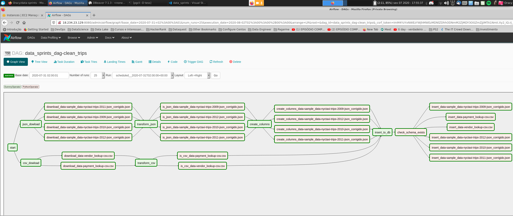

# Airflow

O fluxo final do Airflow ficou como a imagem abaixo:

Explicando o fluxo:

Os Operadores:

- start
- json_download
- csv_download
- transform_json
- transform_csv
- create_columns
- insert_to_db

Sao operadores Dummy para juntar as etapas.

---

Os Operadores:

- Download_data-sample_*
- download_data-vendor
- download_data-payment

Estes sao operadores Python para rodar as funções dentro do arquivo `util.py` e baixar os arquivos do s3 para a pasta do projeto, tanto os arquivos Json quanto os arquivos csv.

---

Os Operadores:

- is_json_data-sample_*
- is_csv_data-vendor
- is_csv_data-payment

Estes sao operadores Python para rodar as funções dentro do arquivo `util.py` e verificar se os arquivos em questão sao tanto json validos quanto csv validos, caso nao seja valido ele vai arrumar o arquivo, e se houver outro arquivo com algum padrão desconhecido, ele iria falhar e avisar.

---

Os Operadores:

- create_columns_data-sample_*

Este é um operador Python que cria colunas necessárias, e edita colunas que precisam ter algum tipo de transformação.

---

O Operador:

- check_schema_exists

Valida se o schema no banco de dados existe para fazer a inserção dos dados, caso nao exista, ele automaticamente cria este schema para inserção.

---

Os Operadores:

- insert_data-sample_*
- insert_data-vendor
- insert_data-payment

Insere os dados tratados, e certos no banco de dados.
